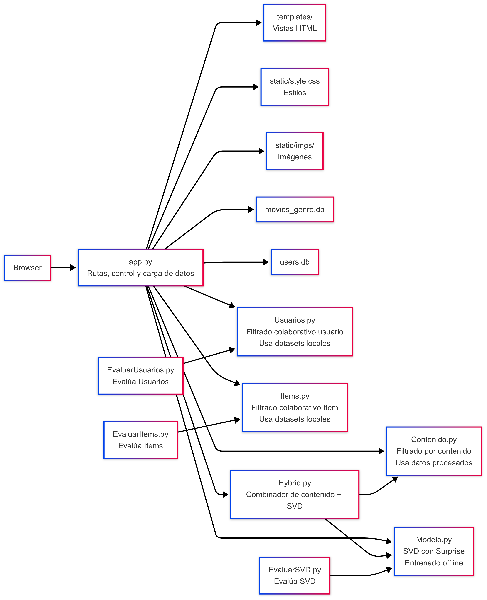

## 🧩 Arquitectura del Sistema de Recomendación

Este diagrama representa la arquitectura del sistema, incluyendo:

- `app.py` gestiona las rutas, el control de flujo y la carga de datos desde las bases de datos SQLite (`movies_genre.db`, `users.db`).
- Los módulos de recomendación (`Contenido.py`, `Usuarios.py`, `Items.py`) trabajan con los datos que les proporciona `app.py`, sin acceder directamente a la base de datos.
- `Hybrid.py` genera recomendaciones combinando los resultados de `Contenido.py` y `Modelo.py` (SVD).
- `Modelo.py` implementa el modelo de factoración matricial entrenado con Surprise.
- Los evaluadores (`EvaluarItems.py`, `EvaluarUsuarios.py`, `EvaluarSVD.py`) usan estos módulos para medir el rendimiento de cada enfoque.
- La interfaz cliente se gestiona a través de `templates/`, `static/` y el navegador.

> ⚠️ Nota: Los módulos de recomendación y evaluación utilizan datasets o modelos previamente procesados, **no acceden directamente a las bases de datos**.
